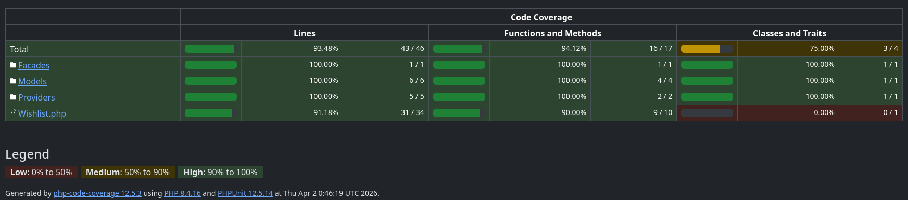

# Tests
The tests are done with [PestPHP](https://pestphp.com/) and [Testbench](https://github.com/orchestral/testbench).

## Execute testing
Compose require dev packages.
To execute them run the following:
```shell
composer test
```

## Current code coverage

