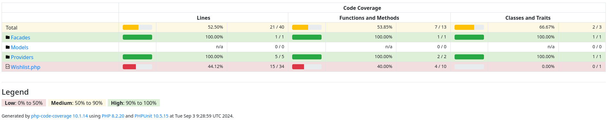

# Tests
The tests are done with [PestPHP](https://pestphp.com/) and [Testbench](https://github.com/orchestral/testbench).

## Execute testing
Compose require dev packages.
To execute them run the following:
```shell
vendor/bin/testbench db:migrate
vendor/bin/testbench db:seed --class=\\Workbench\\Database\\Seeders\\DatabaseSeeder
vendor/bin/pest
```

## Current code coverage

