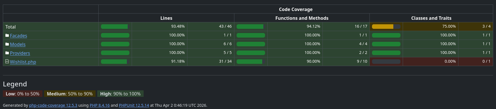

# Tests
The tests are done with [PestPHP](https://pestphp.com/) and [Testbench](https://github.com/orchestral/testbench).

# Table of contents
- [Execute testing](#execute-testing)
- [Current code coverage](#current-code-coverage)

## Execute testing
- composer install the packages and run the tests.
```shell
composer install
```
- to execute them, run the following:
```shell
composer test
```
- if you don't have xdebug installed
```shell
composer test-wcc
```

## Current code coverage


## Static analysis
Run PHPStan for static analysis
```shell
composer analyse
```
